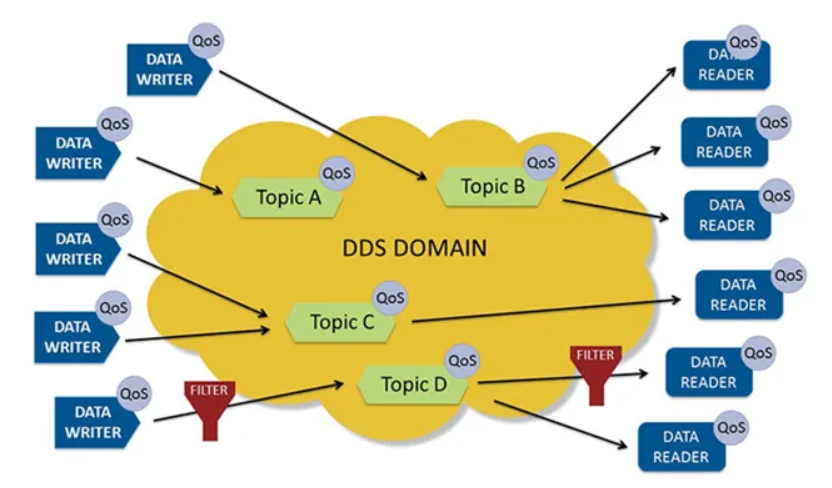
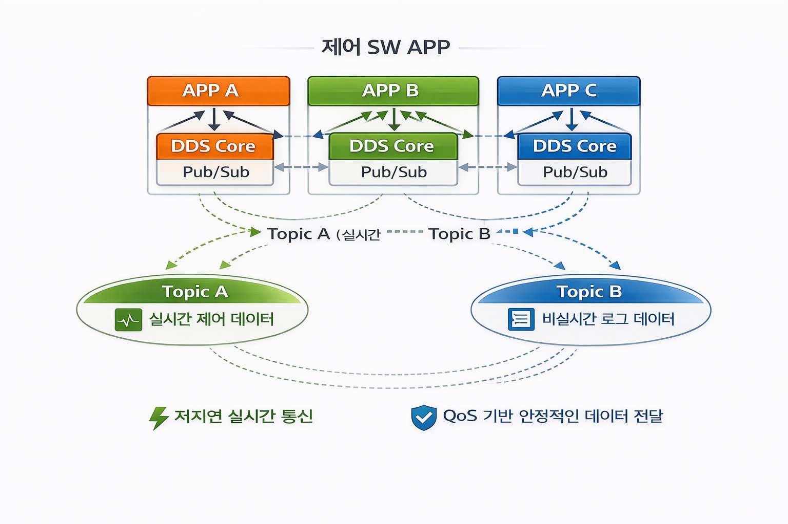
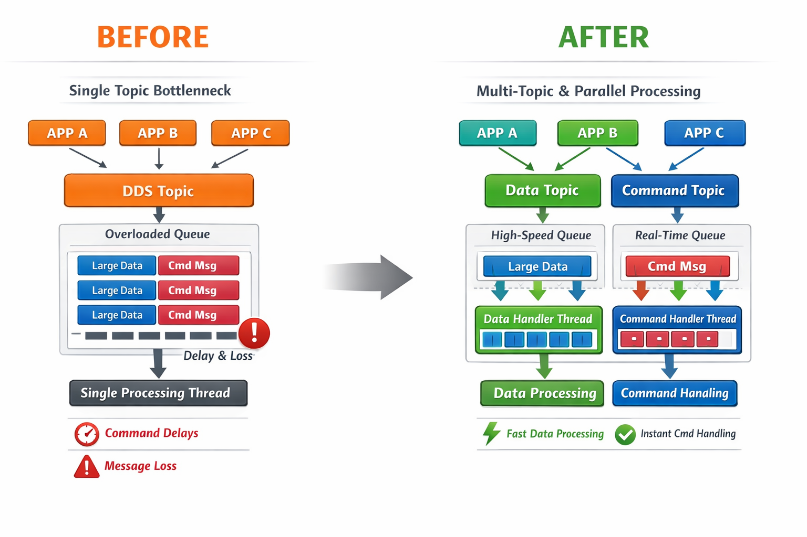
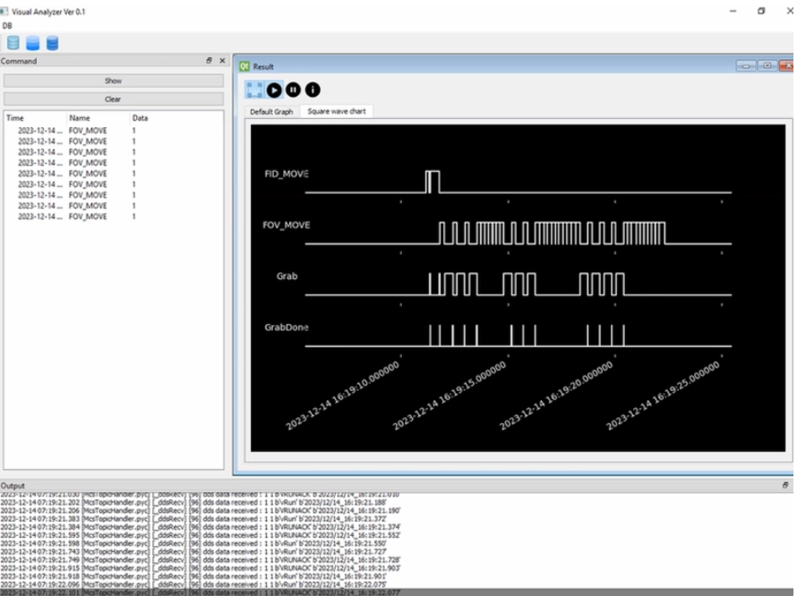

# DDS 기반 SW APP 간 통신 인프라 설계 및 구현

## 1. 프로젝트 개요

- 프로젝트명: DDS 기반 SW APP 간 통신 인프라 설계 및 구현
- 프로젝트 소속: 고영테크놀러지
- 프로젝트 기간: 2023.06 ~ 2023.09
- 프로젝트 인원: 4명

### 프로젝트 개요
본 프로젝트는 사내 SW APP 간 통신 구조를 개선하기 위해  
DDS(Data Distribution Service) 미들웨어 기반 통신 인프라를 구축한 프로젝트이다.

기존 시스템은 기계의 기능 및 모듈별로 APP이 분리되어 있고
각 APP은 Server-Client 기반 Socket 통신으로 연결된 복잡한 구조를 가지고 있다.

이로 인해 통신 경로 확장 시 구조 복잡도가 급격히 증가하고,  
메시지 지연, 손실, 확장성 및 유지보수 측면에서 한계가 존재한다.

본 프로젝트에서는 DDS 미들웨어를 도입하여 APP 간 통신 구조를 단순화하고,  
Monolithic Architecture(MA)에서 Microservices Architecture(MSA)로  
전환을 위한 통신 인프라 기반을 마련하는 것을 목표로 한다.

---

### DDS 개요

DDS(Data Distribution Service)는 중앙 브로커 없이 Publisher와 Subscriber가
Topic 기반으로 직접 통신하는 분산형 Pub/Sub 미들웨어이다.

DDS는 실시간 시스템(real-time system)을 주요 대상으로 설계되었으며,
낮은 지연 시간(Low Latency), QoS(Quality of Service) 기반 데이터 전달 보장,
그리고 느슨한 결합(Loose Coupling) 구조를 핵심 특징으로 가진다.

이러한 특성으로 인해 DDS는 통신 지연이나 데이터 유실이 시스템 안정성에 직접적인 영향을 미치는
실시간 제어 시스템에 적합한 통신 미들웨어로 활용된다.

---

### 시스템 아키텍처
각 APP은 자체 DDS Core를 내장하고 있으며,  
하나의 프로세스 내에서 Publisher와 Subscriber 역할을 동시에 수행하도록 설계되어 있다.

이러한 구조를 통해 각 APP은  
데이터를 생산하는 동시에 소비하는 독립적인 노드로 동작하며,  
외부 통신 서버나 중앙 브로커에 의존하지 않고  
DDS Discovery 메커니즘을 통해 필요한 상대 APP과 직접 통신한다.

즉, 특정 APP이 장애를 일으키더라도  
전체 통신 구조에는 영향을 주지 않는  
분산형(Peer-to-Peer) 통신 구조를 구성하였다.

---

### DDS Communication Flow
DDS 기반 APP 간 통신은 다음과 같은 흐름으로 이루어진다.

1. **Discovery 및 자동 매칭**  
   - DDS Discovery 기능을 통해 Publisher와 Subscriber가 자동으로 서로를 탐색하고 연결된다.
  
2. **데이터 발행**
   - 각 APP은 필요에 따라 Topic 기반으로 데이터를 발행(Publish)한다.

3. **DDS Core 처리**  
   - DDS Core 내부에서 QoS 정책이 적용되고 데이터가 라우팅된다.

4. **병렬 수신 및 처리**  
   - Subscriber 측에서는 Listener 및 Thread 기반 구조를 통해 Topic별 데이터를 병렬로 수신 및 처리한다.

### 프로젝트 목표
- Socket API 기반 복잡한 Server-Client 구조 제거
- APP 간 통신 구조 단순화 및 확장성 확보
- 실시간 제어 시스템에 적합한 저지연 통신 구조 구현
- DDS QoS 기반 안정적인 데이터 전달 환경 구축
- MA → MSA 아키텍처 전환 기반 마련

---

## 2. 담당 역할

### DDS Publisher / Subscriber 개발
- Python / C++ 기반 DDS Publisher 및 Subscriber 구현
- Topic 기반 데이터 및 제어 메시지 송수신 로직 개발

### 실시간 처리 / 비실시간 처리 분리 설계
- DDS 수신 데이터 중 실시간 제어에 필요한 데이터는 즉시 처리하도록 별도 경로로 분리
- 로그 기록 및 상태 추적을 위한 데이터는 비실시간 처리 경로로 분리하여 비동기 처리
- 실시간 처리 로직과 로그 처리 간 상호 간섭 방지

### QoS 시나리오 테스트
- 메시지 손실 및 지연 상황에 따른 QoS 설정 시나리오 테스트
- Reliable / Best-Effort, History, Deadline 등 QoS 조합 검증
- 실시간 데이터와 비실시간 데이터 특성에 맞는 QoS 정책 적용

### DDS Core 이슈 분석
- DDS 통신 과정에서 발생하는 지연 및 메시지 유실 현상 재현
- DDS Core 내부 큐 처리 및 스케줄링 동작을 중심으로 분석

---

## 3. 기술적 문제 및 해결

### 문제 1. 대용량 데이터 전송 시 커맨드 메시지 지연 및 유실

동일한 DDS 토픽을 통해  
대용량 데이터와 커맨드 메시지를 함께 지속적으로 발행하는 환경에서  
일부 커맨드 메시지가 지연되거나 유실되는 문제가 발생하였다.

#### 원인 분석
DDS에서 데이터 전송은 다음과 같은 단계로 이루어진다.

1. Application에서 `write()` 호출
2. QoS 설정에 따라 DataWriter 내부 History Cache에 데이터 저장
3. History Cache에 저장된 데이터가  
   DataWriter 내부 전송 큐(Transport Send Queue)에 적재됨
4. 전송 큐에 적재된 데이터가 네트워크를 통해 Subscriber로 전송

이때 QoS 설정에 의해 관리되는 History Cache는  
데이터의 저장 및 유지 여부(보존 정책)만을 결정하며,  
실제 네트워크 전송 순서와 시점은  
DataWriter 내부의 FIFO 전송 큐에서 결정된다.

본 시스템에서는 대용량 데이터와 커맨드 메시지를  
동일 DataWriter를 통해 혼합 발행하고 있었으며,  
이로 인해 대용량 데이터가 FIFO 전송 큐를 선점하게 되었다.

그 결과 지연에 민감한 커맨드 메시지가 대용량 데이터 뒤에서 대기하는  
Head-of-Line Blocking(앞선 대용량 데이터가 모두 전송될 때까지 뒤의 커맨드 메시지가 전송되지 못하는 현상)
상태에 빠졌고, 커맨드 메시지의 지연 및 논리적 유실 현상이 발생하였다.

이는 토픽 단위 QoS 설정만으로는  
메시지 우선순위 및 전송 타이밍을 제어할 수 없다는 한계를 드러낸 사례였다.

---

### 해결 방법 (송신 경로 개선)

#### 1. Topic / DataWriter 분리
데이터의 성격과 전송 요구사항이 서로 다른 메시지를  
동일한 DDS Topic과 DataWriter로 발행하던 구조를 개선하였다.

대용량 데이터와 커맨드 메시지를 각각 별도의 DDS 토픽으로 분리하고,  
토픽별로 독립적인 DataWriter를 구성함으로써  
Writer 단위로 관리되는 전송 큐를 물리적으로 분리하였다.

이를 통해 대용량 데이터가 전송 큐를 선점하여  
커맨드 메시지 전송을 지연시키는 현상을 제거하였으며,  
각 메시지 유형에 맞는 전송 정책을 독립적으로 적용할 수 있도록 하였다.

---

#### 2. 메시지 특성에 따른 전송 정책(QoS) 차별 적용
메시지의 중요도와 지연 허용 여부에 따라  
전송 신뢰성과 데이터 유지 정책을 다르게 적용하였다.

커맨드 메시지는  
전송 지연이 발생하는 것보다 최신 상태를 빠르게 전달하는 것이 중요하므로,  
이전 메시지는 유지하지 않고 최신 메시지를 즉시 전달하는 정책을 적용하였다  
(BestEffort: 재전송을 기다리지 않고 즉시 전달, KEEP_LAST(1): 최신 메시지 1개만 유지)

반면, 대용량 데이터는  
일부 지연이 허용되더라도 데이터 손실 없이 전달되는 것이 중요하므로,  
전송 신뢰성을 보장하고 일정 개수의 데이터를 유지하는 정책을 적용하였다.
(Reliable, KEEP_LAST(n))

이와 같이 메시지 특성에 맞는 전송 정책을 적용함으로써  
송신 경로에서 불필요한 전송 지연과 전송 큐 포화를 효과적으로 방지하였다.

### 변경 전후 구조 비교

### 변경 결과
구조 변경 이후 동일한 부하 조건에서 테스트를 수행한 결과,  
대용량 데이터 전송 상황에서도 커맨드 메시지의 지연 및 논리적 유실 현상이 재현되지 않았다.

커맨드 메시지의 전송 지연은  
기존 평균 8~10ms 수준에서 약 1ms 수준으로 감소하였으며,  
대용량 데이터 전송 여부와 관계없이 안정적인 즉시 전송이 가능함을 확인하였다.

이를 통해 송신 경로에서 메시지 유형 간 전송 간섭이 제거되었고,  
전송 지연에 민감한 제어 메시지의 실시간성이 보장되었다.  
또한 토픽 및 DataWriter 분리 설계가  
Writer 단위 전송 큐 선점 문제를 효과적으로 해결함을 검증하였다.

---

### 문제 2. Subscriber 처리 지연으로 인한 전체 수신 지연 전파

Subscriber 측에서 특정 토픽의 데이터 처리 시간이 길어지는 경우,  
해당 토픽뿐만 아니라 다른 토픽의 수신까지 함께 지연되는 현상이 발생하였다.  
즉, 하나의 토픽 처리 병목이 전체 수신 경로에 영향을 주어  
시스템 전반의 실시간 응답성이 저하되었다.

---

#### 원인 분석 (DDS 수신/콜백 동작 방식과 지연이 전파된 이유)

DDS에서 Subscriber는 네트워크로 데이터가 도착하면,  
DDS Core가 이를 수신 큐에 적재한 뒤 애플리케이션에 전달한다.  
이때 애플리케이션은 보통 Listener를 등록해  
데이터 도착 이벤트를 콜백으로 전달받는다.

많은 DDS 구현/설정에서 Listener 콜백은  
DDS Core가 호출하는 스레드에서 실행되며,  
콜백이 반환되기 전까지 동일한 디스패치 경로가 다음 이벤트 처리를 진행하지 못할 수 있다.

본 시스템에서는 Listener 콜백 내부에서  
수신 데이터 파싱, 상태 갱신, 로그 기록 등 시간이 소요되는 작업을  
동기적으로 수행하고 있었다.

그 결과, 특정 토픽의 콜백 처리 시간이 증가하면 DDS 디스패치 스레드가 장시간 점유되고,
그동안 다른 토픽의 수신 이벤트 처리(콜백 호출)가 뒤로 밀리며,
수신 큐가 제때 소모되지 못하고 누적되어
하나의 토픽 처리 지연이 다른 토픽 수신까지 차단하는  
Subscriber 측 Head-of-Line Blocking 현상이 발생하였다.

---

### 해결 방법 (수신 경로 개선)

#### 1. Listener 경량화
- Listener에서는 수신 데이터 식별 및 큐잉만 수행
- 데이터 파싱, 검증, 상태 처리 로직 제거
- DDS Core 스레드의 블로킹 최소화

---

#### 2. 토픽별 독립 처리 파이프라인 구성
- 토픽별 전용 처리 큐 및 Worker Thread 구성
- 실시간 제어 데이터와 비실시간 데이터 처리 경로 분리
- 토픽 간 처리 간섭 제거

#### 변경 결과
Listener 경량화 및 토픽별 독립 처리 파이프라인 적용 이후,  
특정 토픽의 처리 지연이 다른 토픽 수신 지연으로 전파되는 현상이 해소되었다.

DDS Listener는 수신 이벤트 전달에만 집중하고 즉시 반환하도록 개선되었으며,  
실제 데이터 파싱 및 후속 처리는 별도 Worker Thread에서 수행되었다.

그 결과 Subscriber 측 수신 큐가 안정적으로 소모되었고,  
수신 처리 지연으로 인한 Head-of-Line Blocking 현상이 제거되었다.  
이를 통해 전체 수신 경로의 처리 안정성과 실시간 응답성이 함께 향상되었다.

---

## 4. 결과 및 성과

- DDS 통신 모듈 개선 후 시스템 메시지 전달 지연 시간 1ms 수준으로 구현
  - 실시간 제어 요구사항을 만족하는 응답 성능 확보
- 토픽 분리 설계를 통해 메시지 유실 및 지연 문제 해결
- 시스템 구성 변경 없이 신규 서비스 및 통신 경로 확장 가능
- DDS Core 안정성 개선에 기여
  - Core 버그 발견 및 내부 공유
- 전체 시스템의 모듈화 및 유지보수 효율성 향상
- Subscriber 측에서 Topic별 Listener 및 Thread 기반으로 병렬 수신 처리

### DDS 데이터 흐름 검증 및 시각화

DDS 통신 구조 변경 이후,  
DDS 데이터 시각화 툴을 활용하여  
토픽별 데이터 수신 상태 및 메시지 흐름을 확인하였다.

---

## 5. 사용 기술

- Language
  - Python
  - C++

- Middleware
  - DDS (Data Distribution Service)

- Architecture
  - Microservices Architecture (MSA)

- Concurrency
  - Multi-threading

- Communication
  - DDS Pub/Sub
  - QoS 기반 메시징

---

## 6. 프로젝트 의의

본 프로젝트는 단순히 통신 방식을 변경하는 수준을 넘어,  
실시간 제어 시스템에 적합한 통신 아키텍처를 재설계한 사례이다.

브로커 없는 DDS 기반 Pub/Sub 구조를 도입함으로써  
APP 간 결합도를 낮추고, 확장성과 실시간성을 동시에 확보하였다.

또한 DDS Core 이슈 분석 및 패치 제안을 통해  
미들웨어 안정성 개선에 기여하였으며,  
향후 신규 제어 APP 및 서비스 확장이 가능한  
MSA 기반 통신 인프라의 기반을 마련하였다.
